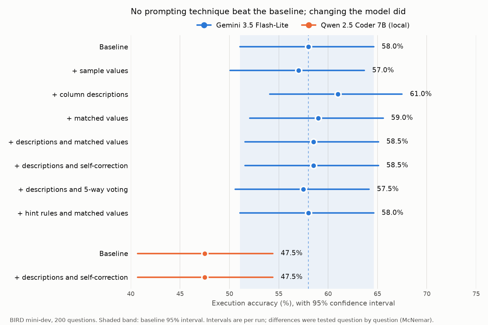

# What Actually Improves Text-to-SQL? Testing 7 Techniques with Proper Statistics

I built a text-to-SQL agent that turns plain-English questions into SQL, runs the query and shows the result. I then used it to test seven popular ways of making such agents more accurate: extra schema context, value matching, self-correction, voting and prompt rules. I measured each one on the [BIRD mini-dev](https://github.com/bird-bench/mini_dev) benchmark with question-by-question significance tests.



**Key findings**

- **None of the seven techniques beat the plain baseline reliably.** Every variant landed between 57% and 61%, inside the noise between identical runs.
- **Changing the model was the only significant result.** Gemini 3.5 Flash-Lite beat a local Qwen 2.5 Coder 7B model by 10 points (p = 0.009).
- **The model is confidently wrong, not randomly wrong.** Voting over 5 answers barely moved accuracy, because most questions got 5 identical answers, including the wrong ones.
- **About a quarter of the "errors" are problems in the benchmark itself**, such as reference answers that contradict their own hints.

**Try it**

```bash
sql-agent ask "How many schools are in Alameda county?" --db california_schools
```

It prints the generated SQL and the result table. By default it uses column descriptions and self-correction, with Gemini 3.5 Flash-Lite. Add `--provider ollama --model qwen2.5-coder:7b` to run it locally.

## Results

Fixed 200-question subset, stratified by difficulty (seed 42), `gemini-3.5-flash-lite`, temperature 0.

| Variant | Exec. accuracy | Exec. errors | Input tokens/query | Latency | Fixed / broken vs baseline | McNemar p |
|---|---|---|---|---|---|---|
| Single-shot baseline | 58.0% | 1.5% | 1,077 | 6.2s | | |
| + 3 sample values per column | 57.0% | 0.0% | 2,915 | 6.2s | 5 / 7 | 0.77 |
| + column descriptions | 61.0% | 0.5% | 2,441 | 6.1s | 13 / 7 | 0.26 |
| + values matched from the question | 59.0% | 1.0% | 1,114 | 7.4s | 9 / 7 | 0.80 |
| + descriptions and matched values | 58.5% | 1.5% | 2,478 | 8.1s | 9 / 8 | 1.00 |
| + descriptions and self-correction | 58.5% | 0.0% | 2,861 | 6.9s | 12 / 11 | 1.00 |
| + descriptions and 5-way voting | 57.5% | 0.0% | 12,206 | 34.1s | 7 / 8 | 1.00 |
| + hint rules and matched values | 58.0% | 1.5% | 1,302 | 6.4s | 15 / 15 | 1.00 |

### Model comparison

Same 200 questions, same code. Qwen 2.5 Coder 7B runs locally through [Ollama](https://ollama.com) on a laptop GPU (GTX 1650), at no cost.

| Model and variant | Exec. accuracy | Exec. errors | Input tokens/query | Latency | Fixed / broken | McNemar p |
|---|---|---|---|---|---|---|
| Gemini 3.5 Flash-Lite, baseline | 58.0% | 1.5% | 1,077 | 6.2s | | |
| Qwen 2.5 Coder 7B, baseline | 47.5% | 13.0% | 950 | 8.4s | 17 / 37 vs Gemini | **0.009** |
| Qwen 2.5 Coder 7B, descriptions and self-correction | 47.5% | 8.5% | 2,882 | 18.6s | 12 / 13 vs Qwen baseline | 1.00 |

**Execution accuracy** means my query returns the same set of rows as the reference query. Paired comparisons use the 199 unique questions (one BIRD question appears twice with the same wording and reference SQL).

### What I learned

In short: none of the common tricks I tried beat the plain baseline by a statistically reliable margin. The only significant difference in the whole project came from changing the model. The remaining mistakes are consistent misreadings of the question or the data, not random slips.

- **Run-to-run noise is as big as the differences.** I ran the baseline and the sample-values variant twice each with identical settings. The baseline scored 58.5% then 58.0%, and sample values scored 60.5% then 57.0%. Even at temperature 0, the model changes its answer on about 7% of questions between runs.
- **Column descriptions may help, but I can't prove it.** They fixed 13 questions and broke 7 (p = 0.26). The self-correction run uses the same first prompt and its first attempts scored about 58%, so the 61% descriptions run was probably partly luck.
- **Random sample values and value matching did not help.** BIRD's hints already spell out most of the values a question needs, so finding them in the database adds little.
- **Almost every miss is a wrong answer, not a crash.** Only 0 to 3 queries per run failed to execute.
- **Self-correction removes crashes but barely changes accuracy.** 24 of 200 questions triggered a retry (an error, no rows, only NULLs, or too many rows). The retries fixed 2 answers and broke 1, and took crashed queries from 1 to 3 per run down to 0. It costs 1.15 model calls per question on average. The wrong answers that remain run fine and return rows that look reasonable, so simple result checks can't spot them.
- **Voting doesn't help because the model is confidently wrong.** Voting over 5 queries scored 57.5%, against 57.0% for its own temperature-0 answer (3 fixed, 2 broken), at 5 times the cost and 34 seconds per question. Most questions got 5 out of 5 identical results, including the wrong ones. Even a perfect way of choosing among the 5 queries would only reach 62.5%. The errors are systematic, not random, so sampling more answers can't fix them.
- **Rules written from the error analysis moved answers around without improving them.** The `hint_rules` variant changed the outcome of 30 questions, the most of any variant, but fixed 15 and broke 15. Simple questions improved from 66% to 71%, while challenging ones fell from 56% to 41%. Rules such as "return only the requested columns" and "don't add conditions" seem to help short queries and hurt long ones. This is also why I don't trust a fix just because it solves the examples it was written for.
- **The model matters more than any trick.** Gemini Flash-Lite beat the local Qwen 7B model by 10 points (37 questions won, 17 lost, p = 0.009), the only significant result here. Qwen crashed on 26 questions against Gemini's 3, mostly from invented column names, such as `Enrollment_K_12` for `` `Enrollment (K-12)` ``.
- **Self-correction didn't rescue the small model either.** I expected a retry loop to help Qwen more, since it crashes 9 times as often. It retried 53 questions and cut crashes from 13% to 8.5%, but the retries fixed only 4 answers and broke 2. Given the error "no such column", the model usually guessed another wrong column instead of finding the right one.

## Error analysis

77 questions were wrong in both the baseline and the voting run. I labeled the cause for a random 30 of them by comparing the generated SQL with the reference SQL ([analysis/errors.csv](analysis/errors.csv)).

| Cause | Count |
|---|---|
| Wrong column or table | 7 |
| Reference answer questionable | 7 |
| Ignored or misread the hint | 5 |
| Column selection (extra or missing columns) | 5 |
| Wrong value (letter case) | 2 |
| Wrong formula or aggregation | 2 |
| Float precision | 1 |
| Broken output | 1 |

- **About a quarter of the "errors" are benchmark problems.** In 8 of 30, the reference SQL contradicts its own hint, uses a date format that isn't in the data, expects exact wording such as 'well-finished', or differs only in the last digits of a float. In one case my answer named the actual race winner and the reference did not.
- **The biggest fixable group is the hint.** The model returned a fraction when the hint asked for a percentage, used AVG when the hint gave SUM/COUNT, or used a different column than the hint named. Two more errors were letter case ('discount' vs 'Discount').
- This led to the `hint_rules` variant. It fixed some of these cases, including the letter-case one, but broke as many others (see the results table).

## Limitations

- **One model family per tier.** I couldn't test a stronger model: on the free tier, Gemini 3.7 Flash allows 20 requests a day and 3.8 Flash was overloaded when I tried it.
- **200 questions, mostly one run per variant.** With about 7% of answers changing between identical runs, only effects of roughly 10 points or more show up as significant. A real gain of 2 to 3 points would need the full 500 questions and repeated runs.
- **Execution accuracy is strict.** A correct answer with an extra column, a different float rounding, or different wording in a text result counts as wrong, and some reference answers are themselves questionable (see the error analysis).

## Setup

```bash
git clone https://github.com/Tejas-1701/text-to-sql-agent.git
cd text-to-sql-agent
python -m venv .venv
source .venv/bin/activate          # Windows: .venv\Scripts\activate
pip install -e ".[dev]"
cp .env.example .env               # Windows: copy .env.example .env
```

Open `.env` and paste your Gemini API key after `GEMINI_API_KEY=`. You can get a free key at [Google AI Studio](https://aistudio.google.com/apikey).

### Get the data

```bash
./scripts/download_data.sh
```

On Windows, download [minidev.zip](https://bird-bench.oss-cn-beijing.aliyuncs.com/minidev.zip) and unzip it into a `data/` folder. The code finds `mini_dev_sqlite.json` and `dev_databases/` anywhere inside `data/`.

## Usage

```bash
sql-agent ask "How many schools are in Alameda county?" --db california_schools
sql-agent run --limit 5                       # quick smoke test
sql-agent run --variant baseline              # 200-question subset
sql-agent run --variant descriptions
sql-agent run --variant self_correct
sql-agent run --variant vote                  # 5 calls per question
sql-agent run --variant hint_rules
sql-agent run --provider ollama --model qwen2.5-coder:7b --rpm 0
sql-agent summary                             # prints the results table
sql-agent chart                               # draws results/accuracy.png
sql-agent compare results\A.jsonl results\B.jsonl   # fixed/broken counts and p-value
sql-agent preview 1471 --variant descriptions_value_match   # show a prompt, no API call
sql-agent errors results\baseline__gemini-3.5-flash-lite__n200.jsonl results\vote__gemini-3.5-flash-lite__n200.jsonl   # questions every run got wrong
```

Each run writes one line per question to `results/`. If a run stops because of rate limits, running the same command again picks up where it left off.

| Option | Default | Meaning |
|---|---|---|
| `--model` | `gemini-3.5-flash-lite` | Any Gemini or Ollama model name |
| `--subset` | `200` | Size of the fixed subset (`0` = all 500) |
| `--rpm` | `10` | Requests per minute, set to stay under the free-tier limit |
| `--input-price`, `--output-price` | `0` | USD per million tokens, used for the cost column |

## How it works

1. **Schema:** read the `CREATE TABLE` statements.
2. **Extra context**, depending on the variant:
   - `schema_values`: 3 example values for every column.
   - `descriptions`: what each column means and what its codes stand for, from BIRD's `database_description` files.
   - `value_match`: words from the question and hint that appear as real values in the database, with their table and column.
   - `descriptions_value_match`: both of the above.
3. **Generate:** ask the model for one SQLite query.
4. **Execute:** run it read-only with a 30-second timeout.
5. **Self-correct** (`self_correct` variant, built on `descriptions`): if the query fails, times out, returns no rows, returns only NULLs, or returns more than 500 rows, I send the query, the problem and the first rows back to the model and ask for a fix. It gets up to 2 extra attempts. It stops early if the model returns the same query, and it never swaps a query that ran for one that crashes.
6. **Vote** (`vote` variant, built on `descriptions`): I ask for 5 queries, one at temperature 0 and four at 0.7, and run them all. Queries that crash are dropped, empty results only count if nothing else ran, and the result returned by the most queries wins. Ties go to the earlier query, so the temperature-0 answer wins a tie.
7. **Hint rules** (`hint_rules` variant): I add five rules to the system prompt, based on the error analysis: treat the hint as the definition and copy its formulas, multiply by 100 for percentages, copy text values exactly as stored, return only the requested columns, and don't add conditions nobody asked for. It also includes the values matched from the question, which fixes letter-case slips.
8. **Compare:** check the result rows against the reference query. For `self_correct` and `vote` I also score the first attempt, so I can count how many answers the extra calls fixed and how many they broke. For `vote` I also record whether any of the 5 queries was right, which shows how much a better way of choosing could still gain.

I compare variants question by question with `sql-agent compare` and McNemar's exact test, because a small change in overall accuracy can hide many questions that flipped in both directions.

## Project layout

```
src/sql_agent/
  dataset.py    load BIRD questions, build the fixed subset
  schema.py     describe tables with sample values
  context.py    column descriptions and value matching
  executor.py   read-only SQL execution with timeout
  llm.py        Gemini and Ollama clients with rate limiting and retries
  agent.py      agent variants
  evaluate.py   evaluation loop, metrics, results table
  errors.py     export always-wrong questions with automatic flags
  chart.py      accuracy chart with confidence intervals
  display.py    result tables for the ask command
  cli.py        command-line entry point
tests/          tests on a small stand-in database, no API calls
```

## Tests

```bash
pytest
```
